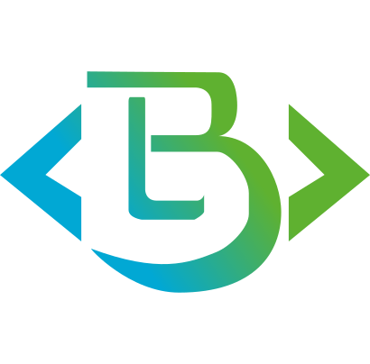

<p align="center">
  <a href="#" target="blank"></a>
</p>

# Descripción general

Proyecto desarrollado en NestJS, es una aplicación backend que permite crear, mostrar, editar y eliminar una marca de vehículo o un vehículo.

# Instalación

1. Clonar el repositorio
```
git clone
https://github.com/emanuelorozco08/parc.git
```
2. Instalar las dependencias
```
npm install
```
3. Ejecutar el proyecto
```
npm run start
```
4. Verificar funcionamiento en el navegador
```
http://localhost:3000
```
5. Creación de datos de prueba
```
http://localhost:3000/seed
```

# Uso
Obtener Lista de vehículos (
method: GET 
)
```
  http://localhost:3000/cars
```
Ejemplo de respuesta:
```
[
  {
    "id": "09adb323-5e24-4cf6-8e33-fa640a5175a6",
    "brand": "Audi",
    "model": "A4"
  },
  {
    "id": "e0230c6a-ce82-4b92-9e42-d64eead42fb5",
    "brand": "BMW",
    "model": "M3"
  },
  {
    "id": "2f7c7d59-2cb6-4d8b-ae85-4eeac40e3edb",
    "brand": "Mercedes",
    "model": "C63"
  }
]
```
Filtrar vehículos por id (
method: GET 
)
```
http://localhost:3000/cars/:id
```
Ejemplo: 
```
http://localhost:3000/cars/09adb323-5e24-4cf6-8e33-fa640a5175a6
```
```
{
  "id": "09adb323-5e24-4cf6-8e33-fa640a5175a6",
  "brand": "Audi",
  "model": "A4"
}
```

Crear un vehículo (
method: POST 
)
```
http://localhost:3000/cars
```
Ejemplo de body:
```
{
  "brand": "Audi",
  "model": "A4"
}
```

Editar un vehículo (
method: PUT 
)
``` 
http://localhost:3000/cars/:id
```
Ejemplo de body:
```
{
  "brand": "Audi",
  "model": "A4"
}
```

Eliminar un vehículo (
method: PATCH
)
```
http://localhost:3000/cars/:id
```

Creación de Marca de vehículo (
method: POST
)
```
http://localhost:3000/brands
```
Ejemplo de body:
```
{
  "name": "Audi"
}
```

Obtener Lista de marcas (
method: GET
)
```
http://localhost:3000/brands
```

Filtrar marcas por id (
method: GET
)
```
http://localhost:3000/brands/:id
```

Editar una marca (
method: PATCH
)
```
http://localhost:3000/brands/:id
```
Ejemplo de body:
```
{
  "name": "Audi"
}
```

Eliminar una marca (
method: DELETE
)
```
http://localhost:3000/brands/:id
```

## Ramificaciones

Este proyecto cuenta con dos ramas:

- `master`: Rama principal (vehículo).
- `brands-crud`: Rama con el proyecto terminado (vehículo y modelo).
